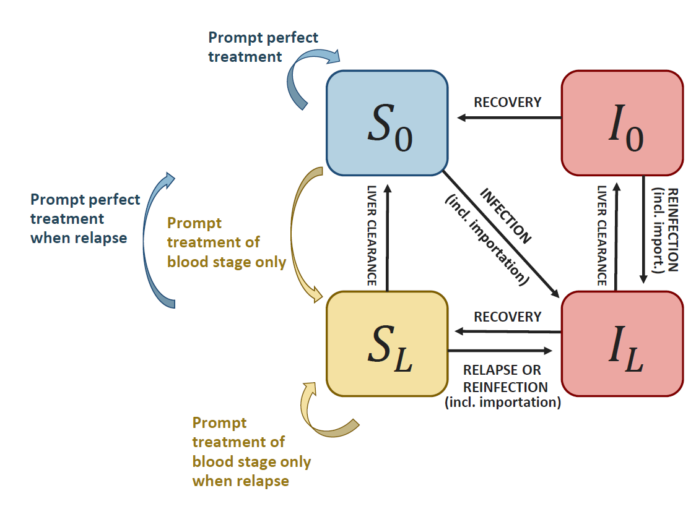

This package contains functions to simulate a compartmental model for Plasmodium Vivax and calculate the associated reproduction number for a given epidemiological setting, based on data on reported local and imported cases.
The model includes case management and vector control.


It is based on @white2016, and can be represented by the following diagram:
```{r pressure, echo=FALSE, fig.cap="Schematic representation of the model", out.width = '80%'}

```
where $I_L$ is the proportion of individuals with both blood and liver stage parasites, $I_0$ is the proportion of individuals with blood stage parasites only, $S_L$ is the proportion of individuals with liver stage parasites only, and $S_0$ is the  proportion of susceptible individuals. 

As in @white2016, it requires 4 biological parameters: $\lambda$ (transmission rate, called "lambda" in the package), $r$ (blood parasites clearance rate), $\gamma_L$ (liver  parasites clearance rate, called "gamma") and $f$ (relapse frequency). Values from the literature can be found for $r$, $\gamma_L$ and $f$. The parameter $\lambda$ is highly setting specific and can be calculated based on incidence and importation data using the functions from this package. This also provides estimates of setting specific reproduction numbers: $R_0$ (in the absence of control intervention) and $R_c$ (considering current control interventions).

For more information, please refer to the associated manuscript:  
Champagne C., Gerhards M. , Lana J., García Espinosa B., Bradley C., González O., Cohen J.,Le Menach A., White M., Pothin E.  **"Using observed incidence to calibrate the transmission level of a mathematical model for Plasmodium vivax dynamics including case management and importation"** 

## How to use the package

```{r setup}
library(VivaxModelR)
```

```{r, include = FALSE}
knitr::opts_chunk$set(
  collapse = TRUE,
  comment = "#>"
)
```

### Calculate the reproduction numbers from data on reported cases

Creating a dummy dataset with reported incidence and the proportion of imported cases  (the user should include their real data). Incidence is in cases per 1000 person-year. Each line corresponds to an administrative area or a year of data.
```{r}
mydata=data.frame(id=c("regionA","regionB"),incidence=c(23,112),prop_import=c(0,0.1))
```
Convert incidence to cases per person day:
```{r}
mydata$h=incidence_year2day(mydata$incidence)
```
Indicate model intervention parameter values for current case management ($\alpha$ and $\beta$) and vector control ($\omega$), as well as the observation rate ($\rho$). 

The parameter $\alpha$ (called "alpha" in the package) represents the probability to receive effective cure for the blood stage infection and the parameter $\beta$  (called "beta") represents the probability that individuals clear their liver stage infection when receiving their treatment. The parameter $\omega$ (called "omega") quantifies the intensity of vector control (0 indicating perfect vector control and 1 indicating the absence of vector control). The observation rate $\rho$ (called "rho") indicates the proportion of all infections that are effectively observed and reported in the incidence data.
The parameter $\alpha$ should reflect the proportion of individual effectively cured (for example because they present symptoms, seek care, and receive and adhere to an effective treatment, as in @galactionova2015 for example).
```{r}
mydata$alpha=c(0.17, 0.12) # proportion of treated cases
mydata$beta=c(0.43,0.42) # proportion of radical cure
mydata$rho=c(0.18, 0.13) # reporting rate (here, we assume that all treated cases are reported)
mydata$omega=c(1,1)  # no vector control
```
Run the model and save the results in a new database.
```{r, results='hide'}
mydata_withR0RC=calculate_r0_rc_fromdata(df=mydata, f=1/72, gamma=1/223, r=1/60, return.all = TRUE)
```
Visualise the output: several additional columns were created, including $R_0$ and $R_c$ for each region/year. 
```{r}
mydata_withR0RC
```
The transmission rate lambda has been calibrated to the incidence and import proportion and it can be used to simulate future scenarios. The quantity $\delta$ (called "delta") representing the daily importation rate was also calculated based on the observed data.

### Simulate a future scenario with the fitted model.
In this section, we will see how to use the calibrated model to simulate the impact of a future intervention.

As a first step, the intervention variables describing the new intervention scenario need to be defined. For each intervention, we create an intervention object containing new parameter values after the intervention.
For example, we want to increase the proportion of radical cure $\beta$ from 0.4 to 0.6 (intervention A) or 0.8 (intervention B).

```{r}
intervention_object0=list(intervention_name="baseline", "alpha.new"=NA, "beta.new"=NA, "omega.new"=NA )
intervention_objectA=list(intervention_name="intervA", "alpha.new"=NA, "beta.new"=0.6, "omega.new"=NA )
intervention_objectB=list(intervention_name="intervB", "alpha.new"=NA, "beta.new"=0.8, "omega.new"=NA )
```

Now, we use the previously calibrated model (using the values contained in mydata_withR0RC) to simulate the interventions. Make sure that the data frame contains a variable called "id" that identifies uniquely each row.

Now, we simulate the model with the new parameterisation.
```{r}
my_intervention_list=list(intervention_object0, intervention_objectA, intervention_objectB)
simulation_model= simulate_vivax_interventions(df=mydata_withR0RC, my_intervention_list)
simulation_model
```
The variable "time" indicates the number of days since baseline. The other variables are the state variables of the model.
The variable I indicates the proportion of all individuals with blood stage infection ($I=I_L+I_0$), i.e. prevalence (including any parasite concentration). The variable incidence indicates the incidence per 1000 person year.

The model outputs can be represented graphically, for example using the ggplot2 package.
```{r , fig.width = 7}
library(ggplot2)
ggplot(simulation_model)+
  geom_line(aes(x=time/365,y=incidence, color=intervention), lwd=1)+
  facet_wrap(id ~., scales = "free_y")+xlab("Year since baseline")
```


### Including uncertainty quantification in data reporting

Creating a dummy dataset with reported numbers or total cases and local cases, i.e. as opposed to imported cases, and the population size of the area (the user should include their real data). Each line corresponds to an administrative area or a year of data. We also added the reporting and case management parameters for each setting.
```{r}
mydata_2=data.frame(id=c("regionA","regionB"),cases=c(114,312),cases_local=c(110,290), population=c(10000,5000))
mydata_2$alpha=c(0.18, 0.13) # proportion of treated cases
mydata_2$beta=c(0.43,0.42) # proportion of radical cure
mydata_2$rho=c(0.17, 0.12) # reporting rate (here, we assume that all treated cases are reported)
mydata_2$omega=c(1,1)  # no vector control

```

Draw 100 samples of the incidence and proportion of imported cases, given the observed total and local number of cases. The uncertainty modelled here is due to population size: for additional information concerning the model, please refer to the associated publication.
```{r}
mydata_2u=sample_uncertainty_incidence_import(mydata_2, ndraw = 100)
```

Run the model and save the results in a new database.
```{r, results='hide'}
mydata_withR0RC_u=calculate_r0_rc_fromdata(df=mydata_2u, f=1/72, gamma=1/223, r=1/60, return.all = TRUE)
```
This database includes 100 replicates of the $R_0$ and $R_c$ calculation, including the sampling uncertainty in the incidence and proportion of imported cases.
```{r}
nrow(mydata_withR0RC_u)
```

### Limitations of the model
The model is a simplified representation of reality, and has therefore some limitations.

Firstly, the model does not include any form of immunity. This simplifcation is acceptable for settings with low to moderate transmission intensity. For high transmission settings (roughly observed annual incidence > 200), other models should be used instead.

Secondly, the model is deterministic and therefore neglects the randomness in very small populations. For very low transmission settings (< 20 reported cases annually), other models should be used instead.

Finally, in some instances, the models cannot provide $R_0$ and $R_c$ estimates (NA values, and lambda=-2). This means that the combination of incidence, importation and parameter values does not correspond to any mathematical solution. In this case, please revise the assumptions used.


## References
