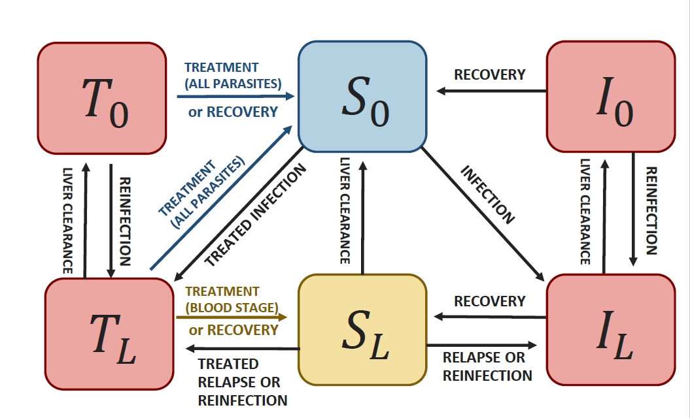

This package contains functions to simulate a compartmental model for *Plasmodium vivax* and calculate the associated reproduction number for a given epidemiological setting, based on data on reported local and imported cases.
The model includes case management and vector control.


It is an extension of @white2016 and @champagne2022, and can be represented by the following diagram:
```{r pressure, echo=FALSE, fig.cap="Schematic representation of the model", out.width = '80%'}

```
where $I_L$ is the proportion of untreated individuals with both blood and liver stage parasites, $I_0$ is the proportion of untreated individuals with blood stage parasites only, $T_L$ is the proportion of treated individuals with both blood and liver stage parasites, $T_0$ is the proportion of treated individuals with blood stage parasites only, $S_L$ is the proportion of individuals with liver stage parasites only, and $S_0$ is the  proportion of susceptible individuals. 

As in @white2016, it requires 4 biological parameters: $\lambda$ (transmission rate, called "lambda" in the package), $r$ (blood parasites clearance rate), $\gamma_L$ (liver  parasites clearance rate, called "gamma") and $f$ (relapse frequency). Values from the literature can be found for $r$, $\gamma_L$ and $f$. The parameter $\lambda$ is highly setting specific and can be calculated based on incidence and importation data using the functions from this package. This also provides estimates of setting specific reproduction numbers: $R_0$ (in the absence of control intervention) and $R_c$ (considering current control interventions).

## How to use the package

```{r setup}
library(VivaxModelR)
```

```{r, include = FALSE}
knitr::opts_chunk$set(
  collapse = TRUE,
  comment = "#>"
)
```

### Calculate the reproduction numbers from data on reported cases

Creating a dummy dataset with reported incidence and the proportion of imported cases  (the user should include their real data). Incidence is in cases per 1000 person-year. Each line corresponds to an administrative area or a year of data.
```{r}
mydata=data.frame(id=c("regionA","regionB"),incidence=c(23,112),prop_import=c(0,0.1))
```
Convert incidence to cases per person day:
```{r}
mydata$h=incidence_year2day(mydata$incidence)
```
Indicate model intervention parameter values for current case management ($\alpha$, $\beta$ and $\sigma$) and vector control ($\omega$), as well as the observation rate ($\rho$). 

The parameter $\alpha$ (called "alpha" in the package) represents the probability to receive effective cure for the blood stage infection and the parameter $\beta$  (called "beta") represents the probability that individuals clear their liver stage infection when receiving their treatment. The parameter $\omega$ (called "omega") quantifies the intensity of vector control (0 indicating perfect vector control and 1 indicating the absence of vector control). The observation rate $\rho$ (called "rho") indicates the proportion of all infections that are effectively observed and reported in the incidence data.
The parameter $\alpha$ should reflect the proportion of individual effectively cured (for example because they present symptoms, seek care, and receive and adhere to an effective treatment, as in @galactionova2015 for example).  
The parameter $\sigma$ is the parasite clearance rate for treated individuals, hence reflecting delays in treatment access.
```{r}
mydata$alpha=c(0.17, 0.12) # proportion of treated cases
mydata$beta=c(0.43,0.42) # proportion of radical cure
mydata$rho=c(0.18, 0.13) # reporting rate (here, we assume that all treated cases are reported)
mydata$omega=c(1,1)  # no vector control
mydata$sigma=c(1/15,1/15)  # treatment delays last on average 15 days
```
Run the model and save the results in a new database.
```{r, results='hide'}
mydata_withR0RC=calibrate_vivax_equilibrium(df=mydata, f=1/72, gamma=1/223, r=1/60, return.all = TRUE, delay = TRUE)
```
Visualise the output: several additional columns were created, including $R_0$ and $R_c$ for each region/year. 
```{r}
mydata_withR0RC
```
The transmission rate lambda has been calibrated to the incidence and import proportion and it can be used to simulate future scenarios. The quantity $\delta$ (called "delta") representing the daily importation rate was also calculated based on the observed data.

### Simulate a future scenario with the fitted model.
In this section, we will see how to use the calibrated model to simulate the impact of a future intervention.

As a first step, the intervention variables describing the new intervention scenario need to be defined. For each intervention, we create an intervention object containing new parameter values after the intervention.
For example, we want to reduce the delays in treatment access $\sigma$ from 15 to 5 days (intervention A) or explore what it would be if it is increased to 20 days (intervention B).

```{r}
intervention_object0=list(intervention_name="baseline", "alpha.new"=NA, "beta.new"=NA, "omega.new"=NA, "sigma.new"=NA, "rho.new"=NA )
intervention_objectA=list(intervention_name="intervA", "alpha.new"=NA, "beta.new"=NA, "omega.new"=NA, "sigma.new"=1/5, "rho.new"=NA  )
intervention_objectB=list(intervention_name="intervB", "alpha.new"=NA, "beta.new"=NA, "omega.new"=NA, "sigma.new"=1/20, "rho.new"=NA  )
```

Now, we use the previously calibrated model (using the values contained in mydata_withR0RC) to simulate the interventions. Make sure that the data frame contains a variable called "id" that identifies uniquely each row.

Now, we simulate the model with the new parameterization.
```{r}
my_intervention_list=list(intervention_object0, intervention_objectA, intervention_objectB)
simulation_model= simulate_vivax_interventions(df=mydata_withR0RC, my_intervention_list, delay = T)
head(simulation_model)
```
The variable "time" indicates the number of days since baseline. The other variables are the state variables of the model.
The variable I indicates the proportion of all individuals with blood stage infection ($I=I_L+I_0+T_0+T_L$), i.e. prevalence (including any parasite concentration). The variable incidence indicates the incidence per 1000 person year.
All variables are detailed in the following table:

```{r echo=FALSE, results="asis"}
library(knitr)
col_id=c("id", "Unique identifier of the area", "")
col_time=c("time", "Number of days since baseline", "days")
col_Il=c("Il", "$I_L$, proportion of untreated individuals with both blood and liver stage parasites", "dimensionless")
col_I0=c("I0", "$I_0$, proportion of untreated individuals with blood stage parasites only", "dimensionless")
col_Il=c("Tl", "$T_L$, proportion of treated individuals with both blood and liver stage parasites", "dimensionless")
col_I0=c("T0", "$T_0$, proportion of treated individuals with blood stage parasites only", "dimensionless")
col_Sl=c("Sl", "$S_L$, proportion of individuals with liver stage parasites only", "dimensionless")
col_S0=c("S0", "$S_0$, proportion of susceptible individuals", "dimensionless")
col_h=c("h", "Reported incidence", "cases per person  year if year=T or per person day if year=F")
col_hl=c("hl", "Local reported incidence", "cases per person  year if year=T or per person day if year=F")
col_hh=c("hh", "Total incidence", "cases per person  year if year=T or per person day if year=F")
col_hhl=c("hhl", "Total local incidence", "cases per person  year if year=T or per person day if year=F")
col_I=c("I", "Prevalence ($I_L+I_0+T_L+T_0$)", "dimensionless")
col_p=c("p", "Proportion of imported cases", "dimensionless")
col_inc=c("incidence", "Reported incidence", "cases per 1000 person year")
col_int=c("intervention", "Name of the intervention", "")
col_step=c("step", "Simulation step", "1 corresponds to the first simulation from equilibrium")
data_name=rbind.data.frame(col_id, col_time, 
                           col_Il,col_I0, col_Sl, col_S0, 
                           col_h, col_hl, col_hh, col_hhl,
                           col_I, col_p, col_inc, col_int, col_step)
names(data_name)=c("Column name", "Description", "Unit")
kable(data_name)

```


The model outputs can be represented graphically, for example using the ggplot2 package.
```{r , fig.width = 7}
library(ggplot2)
ggplot(simulation_model)+
  geom_line(aes(x=time/365,y=incidence, color=intervention), lwd=1)+
  facet_wrap(id ~., scales = "free_y")+xlab("Year since baseline")
```

#### Simulate a future scenario with the fitted model, starting from a previous simulation run

```{r, fig.width = 7}
simulation_model_day= simulate_vivax_interventions(df=mydata_withR0RC, my_intervention_list, year=F, delay=T)
intervention_object0=list(intervention_name="baseline", "alpha.new"=NA, "beta.new"=NA, "omega.new"=NA, "sigma.new"=NA, "rho.new"=NA )
intervention_objectB2=list(intervention_name="intervB", "alpha.new"=NA, "beta.new"=NA, "omega.new"=NA, "sigma.new"=1/15 , "rho.new"=NA  )
my_intervention_list2=list(intervention_object0, intervention_objectA, intervention_objectB2)
simulation_model2= simulate_vivax_interventions(df=mydata_withR0RC, my_intervention_list2, previous_simulation = simulation_model_day, year=F, delay=T)

ggplot(simulation_model2)+
  geom_line(aes(x=time/365,y=I, color=intervention, linetype=as.factor(step)), lwd=1)+
  facet_wrap(id ~., scales = "free_y")+xlab("Year since baseline")+ylab("Prevalence")
```


## Additional interventions

Additional interventions, namely Mass Drug Administration and Reactive Case Detection, can be included in the model.


### Mass Drug Administration (MDA) 

#### Simulate a future scenario with the fitted model, starting from a previous simulation run, and adding Mass Drug Administration (MDA)

MDA is defined with 3 parameters: the coverage (**MDAcov**), the proportion of individuals receiving MDA that experience radical cure (**MDArad_cure**) and the duration of MDA prophylaxis (**MDAp_length**).

```{r, fig.width = 7}
intervention_objectMDA_0=list(intervention_name="baseline", "alpha.new"=NA, "beta.new"=NA, "omega.new"=NA, "sigma.new"=NA, "MDAcov.new"=0.8, "MDAp_length.new"=30, "MDArad_cure.new"=0, "rho.new"=NA  )
intervention_objectMDA_A=list(intervention_name="intervA", "alpha.new"=NA, "beta.new"=NA, "omega.new"=NA, "sigma.new"=1/5 , "MDAcov.new"=0.8, "MDAp_length.new"=30, "MDArad_cure.new"=0, "rho.new"=NA )
intervention_objectMDA_B=list(intervention_name="intervB", "alpha.new"=NA, "beta.new"=NA, "omega.new"=NA, "sigma.new"=1/20, "MDAcov.new"=0.8, "MDAp_length.new"=30, "MDArad_cure.new"=0, "rho.new"=NA  )

my_intervention_list2_MDA=list(intervention_objectMDA_0, intervention_objectMDA_A, intervention_objectMDA_B)
simulation_model2_MDA= simulate_vivax_interventions(df=mydata_withR0RC, my_intervention_list2_MDA, previous_simulation = simulation_model_day, year=F, mda = T, delay=T)

ggplot(simulation_model2_MDA)+
  geom_line(aes(x=time/365,y=I, color=intervention), lwd=1)+
  facet_wrap(id ~., scales = "free_y")+xlab("Year since baseline")+ylab("Prevalence")
```


### Reactive case detection
Reactive case detection (RCD) can also be included as a future intervention, following the framework by @chitnis2019 and @das2021. It is represented with 4 parameters. $\iota$ is the maximum number of reported cases that can be investigated per day (normalised by population size), $\nu$ is the number of individuals tested in each investigation around a reported case, $\tau$ is the targeting ratio reflecting the increased probability of case detection in the vicinity of a confirmed case (see @chitnis2019) and $\eta$ is probability for a positive case detected by RCD to be effectively cured. It is assumed that the probability of liver-stage clearance is the same for people detected via RCD as for treated individuals in general (equal to $\beta$). $\kappa$ is defined in relation to the case management cascade and it represents the common part between $\rho$ and $\alpha$ : it is required for the calculation of incidence.


#### Simulate a future scenario with the fitted model, including reactive case detection

We define new intervention objects with the RCD parameters:
```{r}
intervention_objectA_rcd=list(intervention_name="intervA + rcd 50%", "alpha.new"=NA, "beta.new"=NA, "omega.new"=NA, "sigma.new"=1/5, "iota.new"=5/7/10000, "nu.new"=5, "tau.new"=2, "eta.new"=0.5, "kappa.new"=1, "rho.new"=NA )
intervention_objectA_rcd2=list(intervention_name="intervA + rcd 100%", "alpha.new"=NA, "beta.new"=NA, "omega.new"=NA, "sigma.new"=1/5, "iota.new"=5/7/10000, "nu.new"=5, "tau.new"=2, "eta.new"=1,"kappa.new"=1, "rho.new"=NA  )
intervention_objectA_rcd3=list(intervention_name="intervA + rcd 100% ++", "alpha.new"=NA, "beta.new"=NA, "omega.new"=NA, "sigma.new"=1/5, "iota.new"=Inf, "nu.new"=5, "tau.new"=2, "eta.new"=1 , "kappa.new"=1,"rho.new"=NA )
```
In the third scenario, the neighborhood of all cases reported are investigated.  
The interventions can be simulated as before, adding the option 'rcd=TRUE'. When the delay model is used (delay=TRUE), there are two options for the underlying RCD model: individuals detected by RCD are either treated immediately (referral=FALSE, default) or they have to be referred to a health facility for testing, and hence are treated with similar delays as those detected when seeking care (referral=TRUE).

```{r , fig.width = 7}
my_intervention_list_2=list(intervention_objectA_rcd, intervention_objectA_rcd2, intervention_objectA_rcd3)
simulation_model2= simulate_vivax_interventions(df=mydata_withR0RC, my_intervention_list_2, delay = T, rcd=T)
ggplot(rbind(simulation_model %>%
              dplyr::filter(intervention %in% c("baseline", "intervA")),
            simulation_model2))+
 geom_line(aes(x=time/365,y=I, color=intervention), lwd=1)+
 facet_wrap(id ~., scales = "free_y")+xlab("Year since baseline")+ylab("Prevalence")
```


#### Varying targeting ratio based on prevalence

Following @chitnis2019, the targeting ratio $\tau$ can be made varying over time. The function from @chitnis2019 (additional file 1, fitted on field data from Zambia) is implemented in the function **varying_tau** and can be used in the simulations as follows. First, we define a function taking only prevalence as an argument (other functional forms can be used instead as long as they take prevalence as the only argument):

```{r , fig.width = 7}
  my_tau=function(pr){
    return(varying_tau(nu=5, pr=pr, N=10000))
  }
```
This function can be used as an input in the intervention object for $\tau$.
```{r}
intervention_objectA_rcd_tv=list(intervention_name="intervA + rcd 50%", "alpha.new"=NA, "beta.new"=NA, "omega.new"=NA,"sigma.new"=NA, "iota.new"=5/7/10000, "nu.new"=5, "tau.new"=my_tau, "eta.new"=0.5, "kappa.new"=1, "rho.new"=NA )
intervention_objectA_rcd2_tv=list(intervention_name="intervA + rcd 100%", "alpha.new"=NA, "beta.new"=NA, "omega.new"=NA, "sigma.new"=NA,  "iota.new"=5/7/10000, "nu.new"=5, "tau.new"=my_tau, "eta.new"=1,"kappa.new"=1, "rho.new"=NA  )
intervention_objectA_rcd3_tv=list(intervention_name="intervA + rcd 100% ++", "alpha.new"=NA, "beta.new"=NA, "omega.new"=NA, "sigma.new"=NA, "iota.new"=Inf, "nu.new"=5, "tau.new"=my_tau, "eta.new"=1 , "kappa.new"=1,"rho.new"=NA )
```

```{r , fig.width = 7}
my_intervention_list_3=list(intervention_objectA_rcd_tv, intervention_objectA_rcd2_tv, intervention_objectA_rcd3_tv)
simulation_model3= simulate_vivax_interventions(df=mydata_withR0RC, my_intervention_list_3, rcd=T, delay = T) 
ggplot(rbind(simulation_model2 %>% dplyr::mutate(timevaryingtau="no"),simulation_model3 %>% dplyr::mutate(timevaryingtau="yes" )))+
 geom_line(aes(x=time/365,y=I, color=intervention, linetype=timevaryingtau), lwd=1)+
 facet_wrap(id ~., scales = "free_y")+labs(x="Year since baseline", y="Prevalence", linetype="time varying tau")
```


#### Calibrating the model with RCD at baseline

If there is some RCD already at baseline, this can be accounted for during the model calibration step. The initial dataset should contain the RCD parameters, i.e. $\iota$, $\nu$, $\tau$, $\eta$ and $\kappa$

```{r}
mydata_rcd=mydata
mydata_rcd$iota=c(5/7/365, Inf) # number of index cases investigated per day
mydata_rcd$nu=c(5, 10) # number of secondary cases investigated
mydata_rcd$tau=c(5,5)  # targeting ratio
mydata_rcd$eta=c(0.95,0.95)  # probability of detection of a case
mydata_rcd$kappa=c(0.18,0.13) # common part between rho and alpha (please refer to case management cascade)
```

The calibration step is then executed with the option rcd=T.
```{r, results='hide'}
mydata_withR0RC_rcd=calibrate_vivax_equilibrium(df=mydata_rcd, f=1/72, gamma=1/223, r=1/60, return.all = TRUE, rcd=T, delay=T)
mydata_withR0RC_rcd
```
This dataset can be used for future simulations, similarly to **mydata_withR0RC**.


## Additional features

### Including decay in the vector control parameter
It is possible to include a decay in the vector control parameter $\omega$. For example, an exponential decay, using the following function:
```{r , fig.width = 4}
my_omega=vector_control_exponential_decay(initial_omega = 0.8, half_life = 3, every_x_years = 3, maxtime = 7*365 )
head(my_omega)
ggplot(my_omega)+  geom_line(aes(x=time/365,y=value), lwd=1)+labs(x="years", y=expression(omega))
```


In this example, we implement a vector control intervention every 3 years, with an initial efficacy of $\omega=0.8$ and a half-life of 3 years. Other patterns can be used, especially derived from the AnophelesModel package (Golumbeanu et al. in prep), as long a the dataset is provided as a dataframe with a "time" and "value" column.


```{r , fig.width = 7}
intervention_objectC=list(intervention_name="intervC", "alpha.new"=NA, "beta.new"=NA, "omega.new"=0.8, "rho.new"=NA, "sigma.new"=NA )
intervention_objectCdecay=list(intervention_name="intervCdecay", "alpha.new"=NA, "beta.new"=NA, "omega.new"=my_omega, "rho.new"=NA, "sigma.new"=NA  )

my_intervention_list_vc=list(intervention_object0, intervention_objectC, intervention_objectCdecay)

simulation_model_vc= simulate_vivax_interventions(df=mydata_withR0RC, my_intervention_list_vc, maxtime = 7*365, year=F, delay=T)

ggplot(simulation_model_vc)+
  geom_line(aes(x=time/365,y=incidence, color=intervention), lwd=1)+
  facet_wrap(id ~., scales = "free_y")+xlab("Year since baseline")

```


### Modify the importation rate over time
It is possible to modify the importation parameter $\delta$ over time. For example, we want to leave it constant for 1 year, and then make it decrease linearly to zero over the next 2 years (starting from the initial equilibrium value).  
We write the desired pattern in a dataframe:
```{r , fig.width = 4}
my_trend=data.frame(time=c(0, # baseline
                           365, # after 1 year
                           3*365+1 # after 3 years (+1 to ensure the whole 3 year period is entirely covered)
                           ), 
                    relative_change=c(1, # initial value is constant (*1)
                                      1, # still constant after 1 year (*1)
                                      0  # equalsto zero after 3 years (*0)
                                      ))
```

Secondly, we create a database containing all unique regions, their respective value for $\delta$ and the desired time points:

```{r , fig.width = 4}
  full=list()
  full$id=mydata_withR0RC$id # extract all unique regions from previous database
  full$time=c(0,365,3*365+1) # desired time points
  my_delta0=dplyr::left_join(expand.grid( full ), mydata_withR0RC[,c("id","delta")])
  
  my_delta0

```

We now merge this table with the pre-defined trend and build the input database for the package: 

```{r , fig.width = 4}
my_delta=my_delta0 %>% # create a data.frame with the 
    dplyr::left_join(my_trend) %>%
    dplyr::mutate(value=relative_change*delta) %>%
    dplyr::select(id,time,value)

my_delta
```


This data.frame can then be used in the creation of the intervention object. Other patterns can be used, as long a the dataset is provided as a ata.frame with an "id", "time" and "value" column.


```{r , fig.width = 7}
intervention_objectD=list(intervention_name="baseline", "alpha.new"=NA, "beta.new"=NA, "omega.new"=NA, "rho.new"=NA, "sigma.new"=NA )
intervention_objectD_delta=list(intervention_name="A", "alpha.new"=NA, "beta.new"=NA, "omega.new"=NA, "rho.new"=NA, "sigma.new"=NA , "delta.new"=my_delta)

my_intervention_list_delta=list(intervention_objectD,intervention_objectD_delta)

simulation_model_delta=simulate_vivax_interventions(df=mydata_withR0RC, intervention_list = my_intervention_list_delta, year=F, maxtime = 365*3, delay = T)

ggplot(simulation_model_delta)+
  geom_line(aes(x=time/365,y=incidence, color=intervention), lwd=1)+
  facet_wrap(id ~., scales = "free_y")+xlab("Year since baseline")+ylim(0,NA)

```

In region A, the importation rate was already equal to zero, therefore, the trajectory remains unchanged.


### Including uncertainty quantification in data reporting

Creating a dummy dataset with reported numbers or total cases and local cases, i.e. as opposed to imported cases, and the population size of the area (the user should include their real data). Each line corresponds to an administrative area or a year of data. We also added the reporting and case management parameters for each setting.
```{r}
mydata_2=data.frame(id=c("regionA","regionB"),cases=c(114,312),cases_local=c(110,290), population=c(10000,5000))
mydata_2$alpha=c(0.18, 0.13) # proportion of treated cases
mydata_2$beta=c(0.43,0.42) # proportion of radical cure
mydata_2$rho=c(0.17, 0.12) # reporting rate (here, we assume that all treated cases are reported)
mydata_2$omega=c(1,1)  # no vector control

```

Draw 100 samples of the incidence and proportion of imported cases, given the observed total and local number of cases. The uncertainty modelled here is due to population size: for additional information concerning the model, please refer to the associated publication.
```{r}
mydata_2u=sample_uncertainty_incidence_import(mydata_2, ndraw = 100)
```

Run the model and save the results in a new database.
```{r, results='hide'}
#mydata_withR0RC_u=calculate_r0_rc_fromdata(df=mydata_2u, f=1/72, gamma=1/223, r=1/60, return.all = TRUE)
```
This database includes 100 replicates of the $R_0$ and $R_c$ calculation, including the sampling uncertainty in the incidence and proportion of imported cases.
```{r}
#nrow(mydata_withR0RC_u)
```

### Limitations of the model
The model is a simplified representation of reality, and has therefore some limitations.

Firstly, the model does not include any form of immunity. This simplifcation is acceptable for settings with low to moderate transmission intensity. For high transmission settings (roughly observed annual incidence > 200), other models should be used instead.

Secondly, the model is deterministic and therefore neglects the randomness in very small populations. For very low transmission settings (< 20 reported cases annually), other models should be used instead.

Finally, in some instances, the models cannot provide $R_0$ and $R_c$ estimates (NA values, and lambda=-2). This means that the combination of incidence, importation and parameter values does not correspond to any mathematical solution. In this case, please revise the assumptions used.


## References

